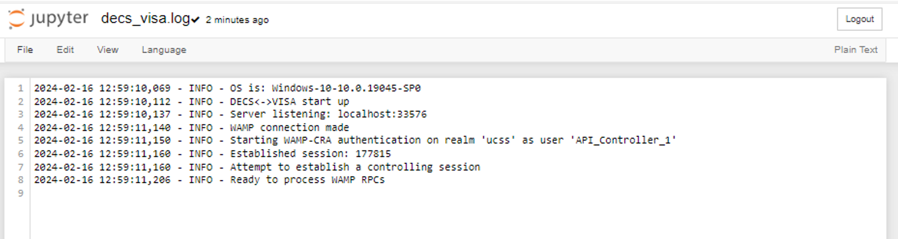
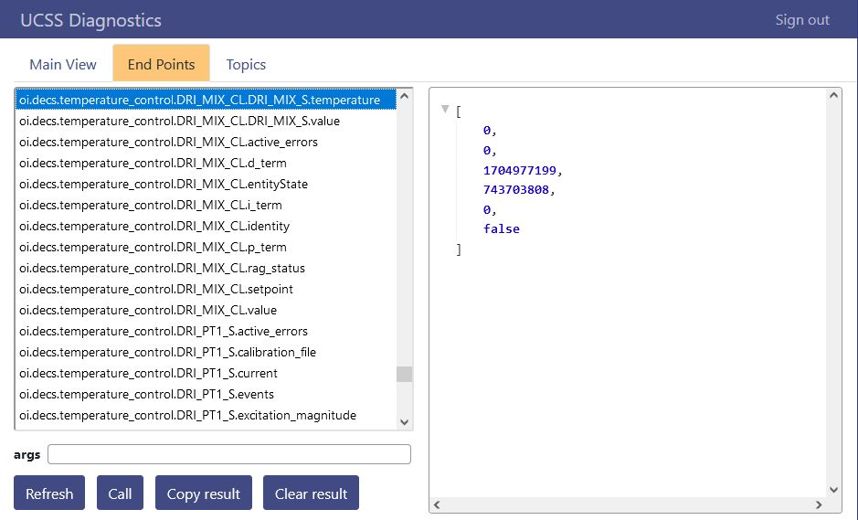
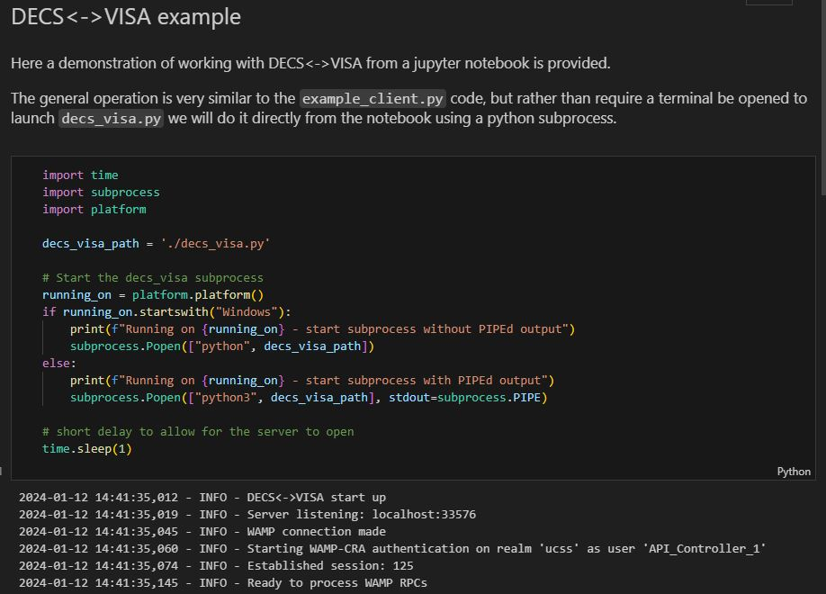

# DECS<->VISA

A simple TCP socket server as a WAMP wrapper for communication with oi:DECS based systems.

## Motivation

Given that oi:DECS based systems already expose an API *via* [WAMP](https://wamp-proto.org/) (a WebSocket sub-protocol) which provides multi-user support, authentication, authorisation, both routed remote procedure call (rRPC) and publish-subscribe messaging paradigms, and allows for efficient asynchronous (event-driven) interactions; an obvious question may be: why not just use that?

In essence, because it is often the case that an oi:DECS based system (such as dilution refrigerator) is used as part of a larger measurement / data acquisition system, often including programmable instruments.  Many of these instruments will conform to standards, such as the Virtual Instrument Software Architecture (VISA).

The intention of the DECS<->VISA interface is to allow 'straightforward' integration of oi:DECS based systems with other instrumentation, or existing measurement automation / data acquisition software that may have been written around the operation of traditional programmable instruments.

DECS<->VISA is also the basis for the oi:DECS [QCoDeS](http://microsoft.github.io/Qcodes/) driver.

## Concept

Allow straightforward, VISA style communication with a socket server (TCPIP::) which will run in its own thread such that long delays (as might be expected from experiments running standard message passing communications) don't block the WAMP / WebSocket thread, hence the WAMP 'auto-ping' remains active and the WAMP session does not time out.


IPC between the WAMP component and the socket server is handled by python `queue.Queue` queues.

When the socket server reads a message it is put onto a queue.  The WAMP component continuously attempts to read from this queue with `.get_nowait()` which will throw if it would block (queue empty) - this keeps the WAMP component alive.

Once a message arrives on the queue, the WAMP rRPC is processed as usual, and the response placed onto an output queue, to the read by the socket server, as the reply.  The socket server just blocks on this output queue read whilst the WAMP processing occurs.

## Setup

The implementation requires `python >= 3.10` as the `match/case` syntax is used.  The other requirements can be installed using the file `requirements.txt` with a command along the lines of:

`pip3 install -r requirements.txt`

Where the exact details will depend on your OS / python environment etc.

## Configuration

There are two places information is stored that requires configuring for your oiDECS system.

**1. The `.env` file inside the `/src` folder** - this contains "secret" information such as system login details. These details must be correct to establish a WAMP session on the oiDECS system.

````bash
WAMP_USER="API_Controller_1"
WAMP_USER_SECRET="******"
WAMP_REALM="ucss"
WAMP_ROUTER_URL="ws://www.xxx.yyy.zzz:8080/ws"
BIND_SERVER_TO_INTERFACE="localhost"
SERVER_PORT="33576"
````
Add the system credentials (username and password) to WAMP_USER and WAMP_USER_SECRET. Although any valid system credentials can be used, `API_Controller_1` is an obvious choice as it indicates to any other users that the system is under 'remote' control.


Keeping this password in the `.env` file means that this information is kept separate from your code - ensure your `.gitignore` file is updated so to not track this/these file(s).  You can create `.env` files from the dummy file template included in the `/src`.

The `WAMP_ROUTER_URL` should be updated to reflect the network settings for the system installation. In place of `www.xxx.yyy.zzz`, add the IP address of your oiDECS system. The IP address for your system can be found from the 'System' tab on the oi:DECS GUI under 'About'.

All other details in the `.env` file are not to be changed.

These details are used by the 'wamp_component' to establish a controlling session on the oi:DECS system.


**2. The `decs_visa_tools/decs_visa_settings.py` file** - this contains general settings such as message delimiters and the path of your `.env` file.

The `decs_visa_settings.py` contains the lines:

````python
# path to the system settings .env file
DOT_ENV_PATH = ".env"
````
Add the file path of your `.env` file here. This will allow you to maintain multiple '.env' files, perhaps for different system users, or to communicate with different oi:DECS based systems.

**NB** whilst relative paths can be convenient, this can also be the cause of some subtle problems if `decs_visa` is launched from scripts in different system locations.  In this case an absolute path may be easier to manage. 

The `decs_visa_settings.py` file is really only included as a convenience to ensure consistent settings between DECS<->VISA and the 'client' examples.

## Operating system

#### Linux and MAC
When running on Linux or MAC, outputs from DECS<->VISA are displayed in your working python script, as shown in the image below. 


#### Windows
When running on Windows, outputs from DECS<->VISA are displayed in a `decsvisa.log` file, which will be created in your working directory. If struggling to estblish a connection between DECS<->VISA and oi:DECS, check the information captured in the `decsvisa.log` file.



## Details of decs_visa_components 

#### The WAMP component

The wamp_component runs the WAMP messaging loop.  In order for the DECS<->VISA to provide control over the oi:DECS system it much establish a 'controlling session'.  The wamp_component first attempts this, and if this fails will close DECS<->VISA.  The logging should provide details of why this failed:

e.g. Unknown user
````
INFO - WAMP connection made
INFO - Starting WAMP-CRA authentication on realm 'ucss' as user 'NOT_Controller_1'
INFO - Leaving WAMP session: oi.decs.router.error.no_such_user
````
Wrong credentials

````
INFO - WAMP connection made
INFO - Starting WAMP-CRA authentication on realm 'ucss' as user 'API_Controller_1'
INFO - Leaving WAMP session: Leaving WAMP session: wamp.error.authentication_failed
````

System is not in a controllable state (local mode)

````
INFO - WAMP client session connected
INFO - Starting WAMP-CRA authentication on realm 'ucss' as user 'API_Controller_1'
INFO - Established session: 93
INFO - DECS system is not in remote control mode
````

System control has already been claimed by another user

````
INFO - WAMP client session connected
INFO - Starting WAMP-CRA authentication on realm 'ucss' as user 'API_Controller_1'
INFO - Established session: 96
INFO - DECS system is under control: GUI_Controller_1
````

If the session is established correctly the log should indicate DECS<->VISA is ready to run:

````
INFO - WAMP client session connected
INFO - Starting WAMP-CRA authentication on realm 'ucss' as user 'API_Controller_1'
INFO - Established session: 104
INFO - Ready to process WAMP RPCs
````
In order to send messages to be processed, the client needs to send them to the socket server.

### The socket server

The socket server opens a `TCP/IP` port to listen for connections.  The `.env` file contains:

````bash
BIND_SERVER_TO_INTERFACE="localhost"
SERVER_PORT="33576"
````
`SERVER_PORT` is the port on which the server will listen.  `BIND_SERVER_TO_INTERFACE` controls where the server will listen.  This value is set to `localhost` (i.e. the loopback interface `127.0.0.1`) as a security measure.  This means the server will only accept connections from the machine on which DECS<->VISA is running (and established / authenticated the WAMP connection from).

**_Caveat utilitor_:** It is possible to accept general network traffic if this value is changed to `""` but the price paid for that convenience is the possibility of an unwanted to connection that can send control commands to oi:DECS.

The server waits for messages to arrive from the socket connection.  Once this happens the message is placed onto a queue to be consumed by the wamp_component.

A connection made to the server will appear in the log:

````
INFO - Server connection: ('127.0.0.1', 53502)
...
(some time later)
...
INFO - Client disconnected
...
(some time later)
...
INFO - Server connection: ('127.0.0.1', 53570)
````

The server is configured to accept only one connection at any time, but note, multiple instances of DECS<->VISA could be running on a single machine (each connecting to different oi:DECS based systems).  In this case the `.env` files for each instance should be updated to ensure that each socket server is exposing a unique port.

**_Caveat utilitor_:** In this configuration users should be sure they are connecting to the correct system - the `*IDN?` query could be useful here!

**NOTE** - all WAMP rRPCs generate a response, so it is important that any client communicating with the system ensure that they read this response to empty the output queue before the next command is sent.

## Details of decs_visa_tools

### The command parser

The wamp_component makes certain assumptions about the format of short command aliases (do they start with `get_` for example - more details on this [below](#the-command-dictionary))

The wamp_component then makes use of the command_parser to map the short commands placed onto its queue to the full WAMP uri, this is done via a 'command dictionary', which is imported here:

````python
from command_dictionary import ProteoxMX_cmd_uri as cmd_uri
````

Commands or requests received on the queue by the wamp_component are checked against the contents of this dictionary to obtain the intended WAMP uri, e.g.

````python
uri = cmd_uri.get(cmd)
    try:
        assert isinstance(uri, str), "uri not returned from command_dictionary"
        ...
````

So any command you send to the socket server should have a corresponding entry in the [command dictionary](#the-command-dictionary).

The command parser may also take further actions based on the `cmd_uri` - typically these are 'convenience' actions such as packing arguments correctly into a WAMP message arguments, or always adding an argument to turn a heater on if its demanded output is > 0.

If you wish to extend the functionality of the system to accommodate additional commands you should check that they will be processed correctly here.

### The command dictionary

Most oi:DECS systems expose a large number of WAMP uris - many of which may not be required to automate a measurement.

The file `command_dictionary.py` contains a (set of) dictionaries that can map 'friendly' command aliases to full WAMP uris, e.g.

````python
ProteoxMX_cmd_uri = {
    "get_MC_T" : "oi.decs.temperature_control.DRI_MIX_CL.DRI_MIX_S.temperature",
    ...
}
````

Several dictionaries can be included in this file, and commands added/removed as required.  Any one of these dictionaries can be imported into the `command_parser.py` as shown above - that setting may need to be updated as required.

There is a convention for these short commands that needs to be followed (or extended) to ensure correct behaviour.

#### get_ commands

Commands that can be sent without arguments (generally query commands) should start with `get_`.

#### set_ commands

Command that need to be sent with arguments (generally command that set values) should start with `set_`.

The 'argument payload' should be appended to the short `set_` command string as a comma (`,`) delimited set of values following a colon (`:`).

For example, a short command to set the mixing chamber temperature control set-point on a Proteox dilution refrigerator system could have the following mapping:

````python
...
"set_MC_T" : "oi.decs.temperature_control.DRI_MIX_CL.setpoint",
...
````

The command requires a payload containing the desired temperature control setpoint, and so a valid command to send to the socket server would be: `set_MC_T:0.015`

**NB** the necessary arguments for a WAMP message to set this setpoint *and* enable the heater output would be `oi.decs.temperature_control.DRI_MIX_CL.setpoint[0.015, 1]` - the additional argument here is added automatically by the command_parser.

### The response parser

On successful return of a WAMP message, the wamp_component passes the returned response (generally a list of values) to the 'response_parser'.

Here the response is examined to determine its 'record type' - an enumeration (enum) that defines the structure of the record.

````python
class OIRecordType(IntEnum):
    """ Utility class to allow the various OIDataRecord
    types to be accessed as enum values"""
    TEMPERATURE = 0
    PRESSURE = 10
````

An attempt is made to match the message response type against this enum. 

````python
match data_record_type:
    case  OIRecordType.TEMPERATURE
````

And depending of the message type, the item(s) of most interest are packaged as a string to be returned by the socket_server to the client.

If you wish to extend the functionality of the system, you should ensure any new record types are handled correctly here.


#### Record types

If you are unsure of the arguments of returned record types, the 'diagnostic' utility provided as part of the system GUI is a good way to explore:



## Examples

When running examples or tests it may be useful to increase the logging level.  This is set inside the `decs_visa_tools/base_logger.py` file

````python
# Log everything / something
#logger.setLevel(logging.DEBUG)
logger.setLevel(logging.INFO)
````
At `DEBUG` level the steps taken in the evaluation of any messages will be displayed.

```
...
DEBUG - Forwarding Server Received: "set_MC_T:4"
DEBUG - set_ command uri: "oi.decs.temperature_control.DRI_MIX_CL.setpoint" args: [4.0, 1]
DEBUG - WAMP response: (1050, 0, 1705056156, 709110784, 4.0, 1, 1)
DEBUG - Parsing response: (1050, 0, 1705057628, 186342144, 4.0, 1, 1)
DEBUG - Forwarding Server Sending: 4.0
...
```

### Example client

The `client_example.py` file has a simple TCP/IP client based on the `PyVISA` package that can be used to communicate with DECS<->VISA as a demonstration of how the oi:DECS system could be integrated with a typical VISA based automated measurement system.

As a result, this example will likely be familiar to anybody who has used the programmable interface of any VISA type instrument.

#### PyVISA-py

The example expects to use the [PyVISA-py](https://pyvisa.readthedocs.io/projects/pyvisa-py/en/latest/) VISA backend, if you plan to use a different backend you should adjust this value.

```python
# set the resource manager to use the PyVISA-py backend
try:
    rm = visa.ResourceManager('@py')
except (ModuleNotFoundError, ValueError) as e:
    print(e)
    # perhaps pyvisa-py isn't installed correctly
    sys.exit(1)
```

#### Connection string

The connection string contains the information required to open a connection to the server - these need to match the running configuration.

```python
# define the connection parameters for the socket server
# NB the correct address and port are required
decs_visa_server_ip = "localhost"
decs_visa_server_port = "33576"

# generate the server connection string
pyvisa_connection = f"TCPIP0::{decs_visa_server_ip}::{decs_visa_server_port}::SOCKET"
```

#### Output

From the client_example the output should be a set of command and response pairs:

```
*IDN? => Oxford Instruments, oi:DECS, decs-442a7b, 0.6.0.2338
get_PT2_T1 => 292.9033
set_MC_T:4 => 4.0
...
```

**NOTE** - as mentioned above all rRPCs should be sent to the system using the `pyVisa` 'query' command (not a 'write') to ensure the response is read from the server. 

The DECS<->VISA logs can also be examined for more details on the server sider processing (if the logging level is set to DEBUG).

### Example notebook

The file `notebook_example.ipynb` contains an example of working with DECS<->VISA from a jupyter notebook.

Details of this are included in that file directly.


